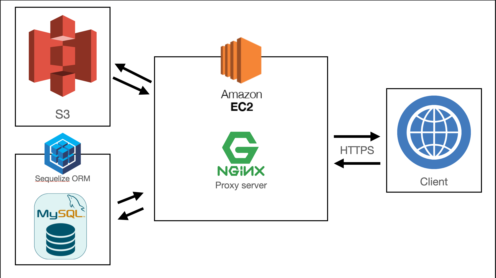

# 🔥Motiiv SERVER🔥

#### 일을 시작하는 순간, Motiiv
> 일을 시작하기 직전, 부스트️⚡️를 얻고 싶다면?  
나의 시선을 뺏는 많은 콘텐츠 속에서 내가 원하는 영상만 켜고  
영상을 본 뒤 나의 워크스페이스로 바로 이동하세요!   
개발 기간 : ~2021-01-16

 

## ✔ Dependencies Module

&nbsp;
 

## ✔ ERD

&nbsp;
 

## ✔ 서버 아키텍처

&nbsp;
 

## ✔ 핵심 기능 설명

[핵심 기능 명세서](https://docs.google.com/spreadsheets/d/1fPKu4xvO4wWvcnEqPe163wR8roqUH5LwxRmn0LXWtkY/edit#gid=0)

&nbsp;
 

## ✔서버 개발자
| **🎩  [김우영](https://github.com/w00ing)** | **🐧  [김정재](https://github.com/Jeongggjae)** |
| :------------------------------------------: | :--------------------------------------------: |
  |   |

 

## ✔ 역할 분담

- API 및 명세서 작성:
  - 유저, 워크스페이스, 관리자, 섹션 관련: 김우영
  - 동영상 관련: 김정재
- README 작성: 김우영
- 배포, SSL 인증서 연결 및 자동화: 김우영
- 자동 테스트 환경 구축: 김우영

 

## ✔모티브의 프론트
* [Front](https://github.com/Motiiv/motiiv-front)