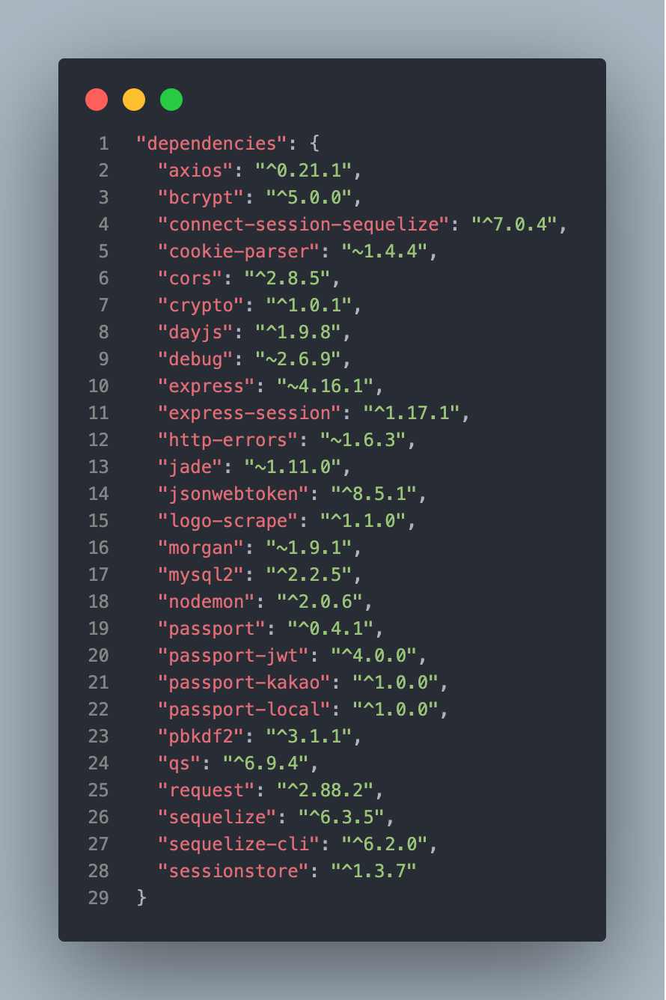
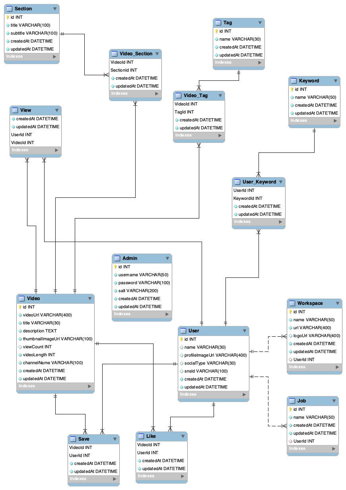

## 1. Dependencies Module

  
이미지

  

&nbsp;

## 2. ERD

  
이미지

  

&nbsp;

## 3. 핵심 기능 설명

[핵심 기능 명세서](https://docs.google.com/spreadsheets/d/1fPKu4xvO4wWvcnEqPe163wR8roqUH5LwxRmn0LXWtkY/edit#gid=0)

&nbsp;

## 4. 역할 분담

- API 및 명세서 작성:
  - 유저, 워크스페이스, 관리자, 섹션 관련: 김우영
  - 동영상 관련: 김정재
- README 작성: 김우영
- 배포: 김우영
